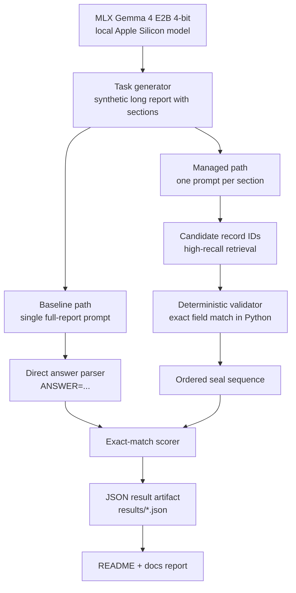
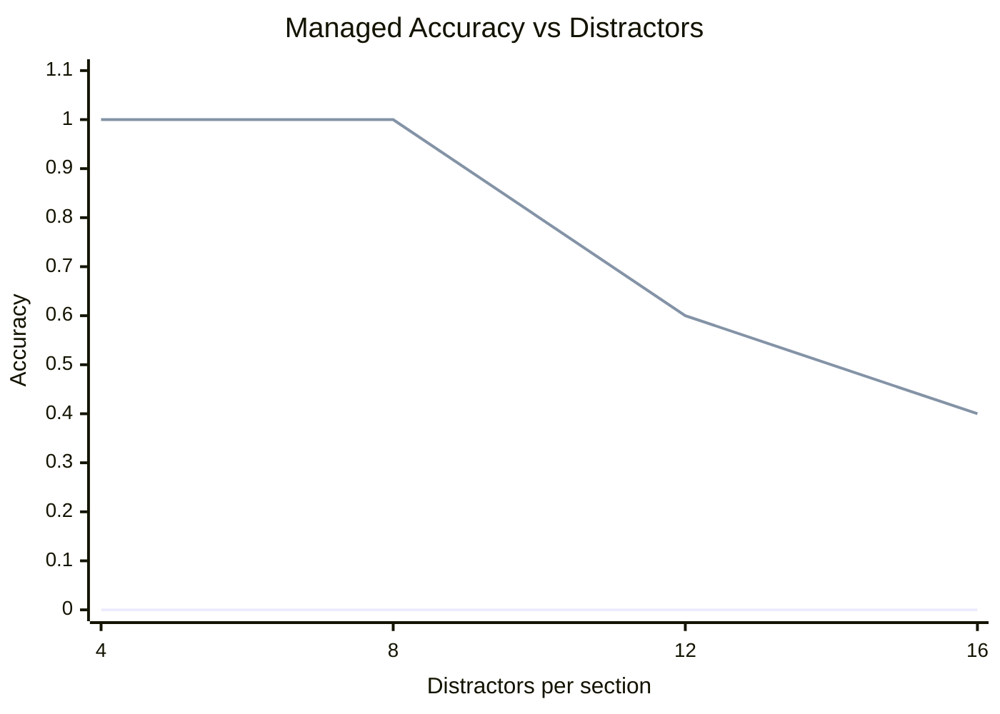
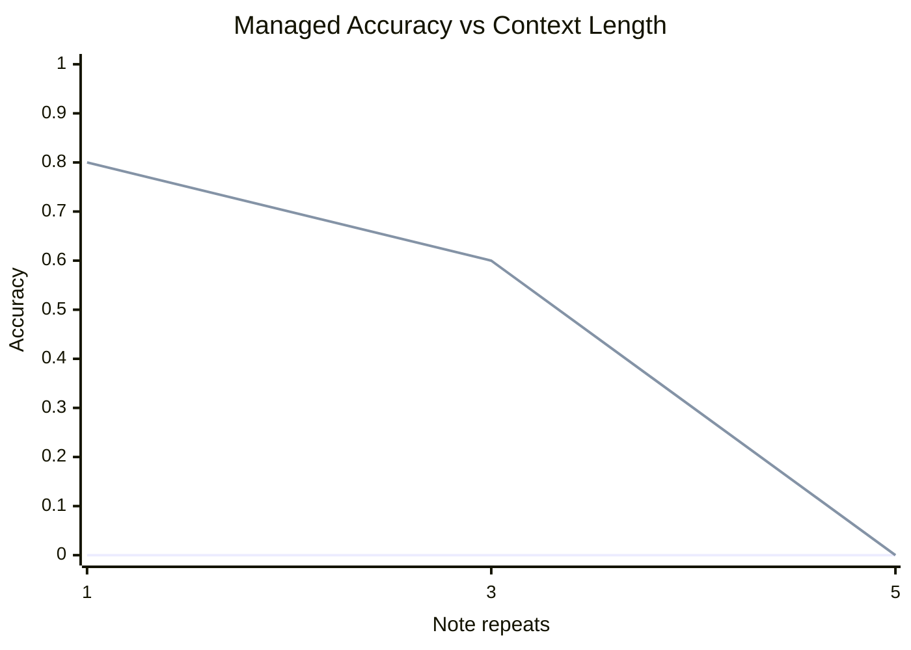

# latent-planning

This repo is a local pilot for the "mismanaged geniuses" hypothesis: can the same small frontier-ish model do meaningfully better on a long-context task when we replace a single prompt with a simple decomposition scaffold?

The current pilot uses `mlx-community/gemma-4-e2b-it-4bit` on Apple Silicon. The benchmark is synthetic on purpose so we can grade it exactly:

- The model sees a long report split into sections.
- Each section contains one true target record and many near-miss distractors.
- The baseline gets the whole report in one shot and must return the ordered seal sequence directly.
- The managed condition queries the same model section-by-section for high-recall candidate IDs, then validates those IDs deterministically before assembling the final answer.

That is not a complete test of the paper's hypothesis. It is a narrow pilot that asks a precise question: does a decomposition scaffold help the same local model recover structured evidence across a longer context than a single direct call?

## Architecture

What is implemented today:



Runtime shape:

- `latent-planning check-model` verifies the local MLX snapshot.
- `latent-planning run-pilot` loads one model instance and runs both conditions over the same generated tasks.
- The baseline uses one call per task.
- The managed condition uses one call per section, then hands off exact bookkeeping to deterministic code.
- Results are persisted as JSON so runs can be compared later.

## Why MLX

MLX is the right backend on this machine:

- the MLX 4-bit Gemma snapshot is already present in the local Hugging Face cache
- `mlx_lm` loads and runs the model successfully
- `llama-cli` and `ollama` are not installed locally, so GGUF would require extra setup with no obvious upside for this pilot

## Commands

Check whether the local MLX snapshot exists:

```bash
uv run latent-planning check-model
```

Run the pilot and write a JSON report:

```bash
uv run latent-planning run-pilot
```

Aggregate multiple result files into a markdown evaluation report:

```bash
uv run latent-planning build-report results/*.json --output docs/extended_evaluation.md
```

The default run uses:

- `sections=8`
- `distractors_per_section=6 10 14`
- `seeds=0 1 2`

Results are written to `results/`.

## Evaluation Snapshot

Across the expanded local evaluation set:

| Experiment | Runs | Avg report chars | Baseline acc | Managed acc | Baseline latency (s) | Managed latency (s) |
| --- | --- | --- | --- | --- | --- | --- |
| `distractor-sweep` | 20 | 14497 | 0.00 | 0.75 | 2.07 | 3.73 |
| `section-sweep` | 15 | 14488 | 0.00 | 0.93 | 2.01 | 3.44 |
| `context-sweep` | 15 | 28013 | 0.00 | 0.47 | 3.01 | 4.10 |

Outcome breakdown over all expanded runs:

| Outcome | Count |
| --- | --- |
| Managed only | 36 |
| Baseline only | 0 |
| Both pass | 0 |
| Both fail | 14 |

High-level read:

- the baseline never won a run
- the managed scaffold stayed strong under extra distractors and section count
- the managed scaffold eventually collapsed when raw context got too long

### Managed Accuracy vs Distractors



### Managed Accuracy vs Context Length



## Experiment Plan

The written plan lives in [docs/mgh_experiment_plan.md](/Users/dylan/learning-projects/latent-planning/docs/mgh_experiment_plan.md).
The expanded results and all tables/charts live in [docs/extended_evaluation.md](/Users/dylan/learning-projects/latent-planning/docs/extended_evaluation.md).

## Interpretation

The broader evaluation supports a narrow version of the hypothesis:

- the model already contains enough local competence to solve the subproblems
- the failure mode is at least partly in how we allocate attention and calls, not only in model weights
- decomposition helps much more than one-shot prompting on this task family, but it is not enough to fully defeat large context growth

If both conditions fail, the likely interpretations are:

- the task is still too hard for the model even after decomposition
- the scaffold is poorly chosen
- the hypothesis does not hold on this task family

## Next Steps

- Add run-to-run comparison tooling so new results can be benchmarked against the first pilot instead of inspected manually.
- Stress the current scaffold with harder settings: more sections, more distractors, longer notes, and noisier field names.
- Replace fixed sectioning with recursive splitting so the manager chooses where to zoom in next.
- Add ablations to separate which part of the gain comes from decomposition versus deterministic validation.
- Expand beyond retrieval-heavy tasks into multi-hop reasoning and real code-edit workflows.

## Things To Test Next

- Variable-depth planning: let the model decide whether to answer directly, inspect sections, or recurse into subsections.
- No-validator mode: require the model to return structured JSON all the way through and measure how much accuracy drops.
- Different decomposition languages: candidate IDs, free-form plans, tool-call style actions, or recursive loop/code execution.
- Context-length scaling: hold the task constant while increasing report length until both methods fail.
- Realistic schema drift: rename fields, reorder records, or add irrelevant prose so the scaffold cannot overfit the template.
- Cross-model comparison: run the same harness against a stronger MLX model and measure whether better weights reduce the value of scaffolding.
- Codebase tasks: adapt the benchmark to multi-file bug localization where each chunk is a file and the final answer is a patch target set.
