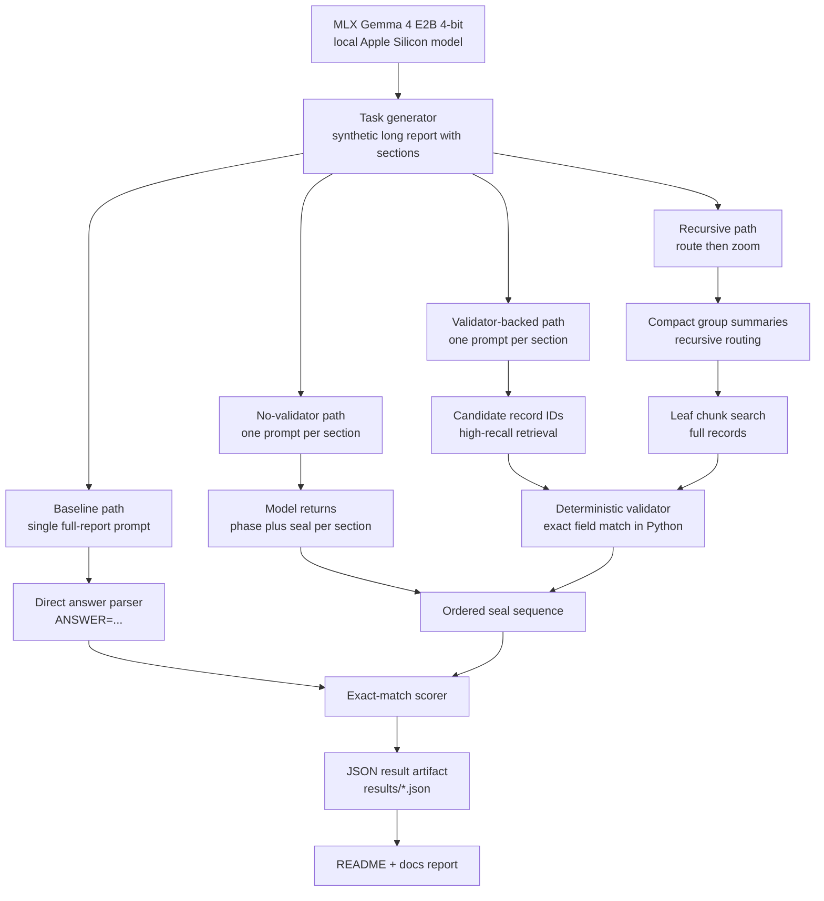
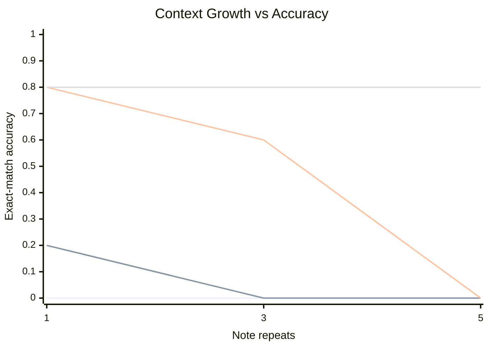
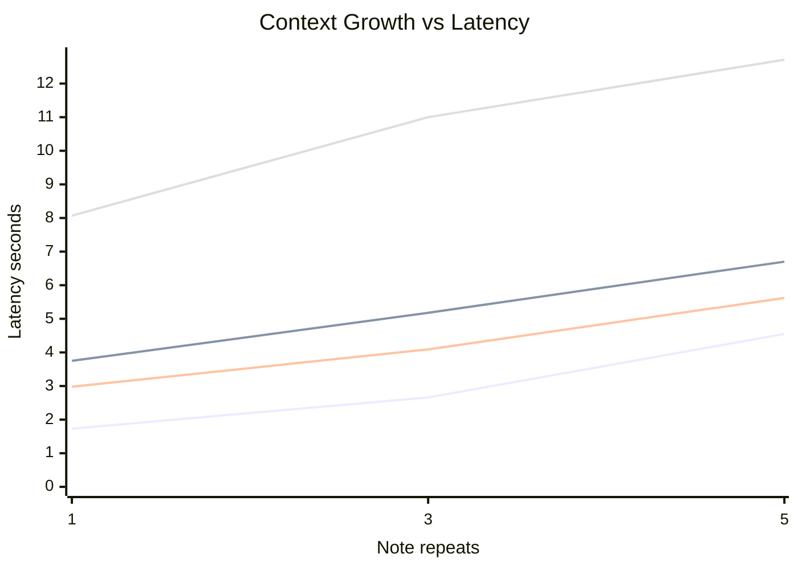
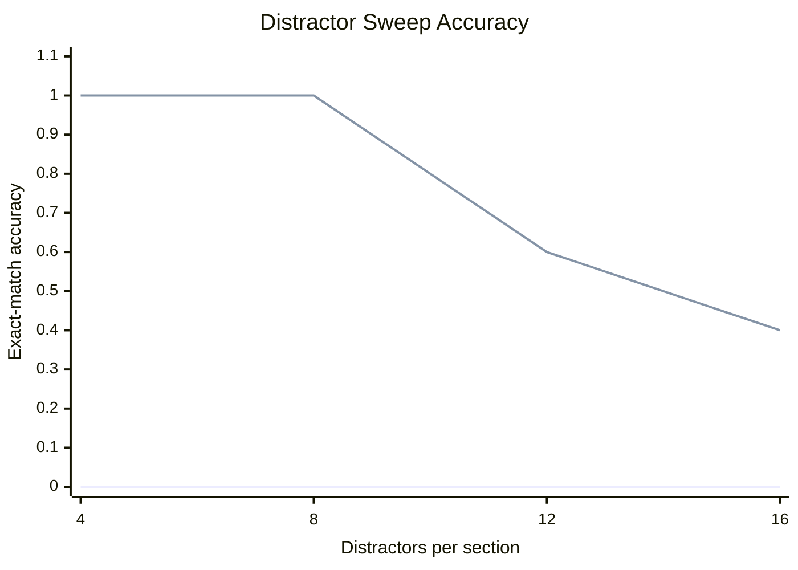
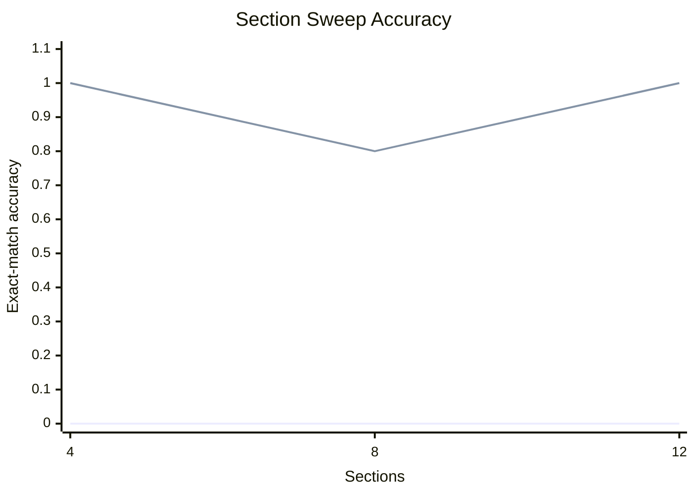
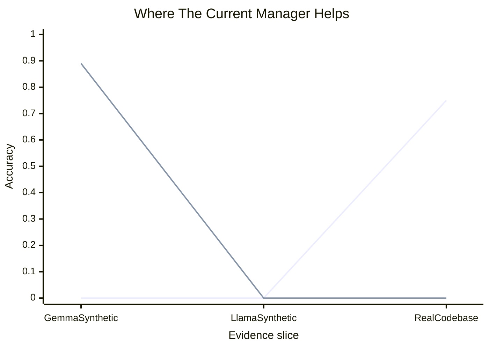

# latent-planning

This repo is a local pilot for the "mismanaged geniuses" hypothesis: can the same local model do materially better when we change how it is managed, rather than changing the model weights?

The current pilot uses `mlx-community/gemma-4-e2b-it-4bit` on Apple Silicon and tests one narrow question:

- The model sees a long synthetic report split into sections.
- Each section contains one true target record and many near-miss distractors.
- The task is to recover the exact ordered seal sequence for the target records.
- We compare one-shot prompting against several decomposition strategies on the same tasks.

This is not a full proof of the hypothesis. It is a controlled local benchmark for one claim: better decomposition can unlock capability that is mostly absent in a single direct prompt.

## What Is Being Compared

| Strategy | What the model has to do | Intuition |
| --- | --- | --- |
| Baseline | Read the whole report and answer in one call | One large exam question |
| No-validator manager | Search one section at a time, but still copy out exact `phase` and `seal` fields itself | Smaller exams, but still does all bookkeeping alone |
| Validator-backed manager | Search one section at a time, return candidate IDs, then let Python verify exact matches and assemble the answer | Smaller exams plus a calculator for exact bookkeeping |
| Recursive manager | Route over compact summaries first, then zoom into likely leaf chunks | First decide where to look, then inspect details |

## Architecture

What is implemented today:



Runtime shape:

- `latent-planning check-model` verifies that the local MLX snapshot exists.
- `latent-planning run-pilot` loads one model instance and evaluates the selected conditions over the same generated tasks.
- `latent-planning build-report` aggregates JSON result files into tables and charts.

## Why MLX

MLX is the right backend on this machine:

- the MLX 4-bit Gemma snapshot is already present in the local Hugging Face cache
- `mlx_lm` loads and runs the model successfully
- `llama-cli` and `ollama` are not installed locally, so GGUF would require extra setup with no clear upside for this pilot

## Commands

Check whether the local MLX snapshot exists:

```bash
uv run latent-planning check-model
```

Run the default baseline-vs-managed pilot:

```bash
uv run latent-planning run-pilot
```

Run the full ablation on one context setting:

```bash
uv run latent-planning run-pilot \
  --label ablation-context-sweep \
  --sections 8 \
  --distractors-per-section 10 \
  --note-repeats 3 \
  --seeds 0 1 2 3 4 \
  --include-no-validator-manager \
  --include-recursive-manager
```

Rebuild the markdown report from saved JSON files:

```bash
uv run latent-planning build-report \
  results/distractor-sweep.json \
  results/section-sweep-s4.json \
  results/section-sweep-s8.json \
  results/section-sweep-s12.json \
  results/ablation-context-sweep-r1.json \
  results/ablation-context-sweep-r3.json \
  results/ablation-context-sweep-r5.json \
  --output docs/extended_evaluation.md
```

The full report lives in [docs/extended_evaluation.md](docs/extended_evaluation.md). The experiment plan lives in [docs/mgh_experiment_plan.md](docs/mgh_experiment_plan.md).

## Evaluation Snapshot

The current report set aggregates `50` runs across distractor growth, section growth, and the new context ablation.

### Experiment Summary

| Experiment | Runs | Avg report chars | Baseline acc | Managed acc | No-validator acc | Recursive acc | Baseline latency (s) | Managed latency (s) | No-validator latency (s) | Recursive latency (s) |
| --- | --- | --- | --- | --- | --- | --- | --- | --- | --- | --- |
| `ablation-context-sweep` | 15 | 28013 | 0.00 | 0.47 | 0.07 | 0.80 | 2.98 | 4.23 | 5.21 | 10.59 |
| `distractor-sweep` | 20 | 14497 | 0.00 | 0.75 | - | - | 2.07 | 3.73 | - | - |
| `section-sweep` | 15 | 14488 | 0.00 | 0.93 | - | - | 2.01 | 3.44 | - | - |

### How To Read The Main Ablation

Moving right means more repeated note text, so the report gets longer without changing the underlying task. Higher is better on the accuracy chart. Lower is better on the latency chart.

| Context size | Baseline acc | No-validator acc | Flat managed acc | Recursive acc |
| --- | --- | --- | --- | --- |
| `1x` notes | 0.00 | 0.20 | 0.80 | 0.80 |
| `3x` notes | 0.00 | 0.00 | 0.60 | 0.80 |
| `5x` notes | 0.00 | 0.00 | 0.00 | 0.80 |





### What The Other Sweeps Say

The context ablation is the most important visual, but the simpler sweeps matter because they show the model is not failing everywhere.

| Sweep | What changes | Result |
| --- | --- | --- |
| Distractor sweep | More near-miss records per section | Flat managed stays above zero even at the hardest setting, baseline stays at zero |
| Section sweep | More sections to search | Flat managed remains very strong overall, baseline stays at zero |
| Context ablation | Same task, much longer repeated notes | Flat managed eventually breaks, recursive does not |





### Outcome Breakdown

| Outcome | Count |
| --- | --- |
| Flat managed beats baseline | 36 |
| No-validator beats baseline | 1 |
| Recursive rescues flat-managed failures | 5 |
| Baseline only | 0 |
| Any non-baseline method succeeds | 41 |
| All methods fail | 9 |

## Intuitive Read

The cleanest way to read these results is:

- Giving the model smaller subproblems helps a lot.
- Giving the model smaller subproblems is not enough by itself.
- The strongest gains come from combining decomposition with either exact external bookkeeping or better routing.

The no-validator line is the key ablation. It asks: what if we still decompose, but the model has to do the exact copying and ordering itself? The answer is that performance mostly disappears. That means the gain is not just "more calls"; it comes from structuring the task so the model only does the fuzzy part and deterministic code does the exact part.

The recursive line is the second key result. Flat section-by-section management works when the report is moderately sized, but it breaks when the context gets very long. Recursive routing fixes that by first asking where to look, then only reading those leaf chunks in detail.

## Conclusion

This repo now supports a stronger conclusion than the first pilot.

On this task family, the same local Gemma model clearly has the knowledge needed to solve the problem, but it does not reliably express that capability in one-shot prompting. Flat decomposition helps a lot, deterministic validation adds major reliability, and recursive routing is what keeps performance alive once context length becomes the real bottleneck.

The most defensible conclusion is therefore:

- the pilot supports the narrow "mismanaged geniuses" claim on this benchmark
- decomposition policy matters, not just model size
- deterministic support code is currently part of what makes the capability appear
- recursive decomposition is the most promising direction in this repo, but it is also the most expensive path in latency and model calls

## Broader Suite

The repo now also includes a broader transfer test across three task families:

- prose retrieval
- ledger aggregation
- code-like localization

That broader run lives in [broad_evidence_report.md](/Users/dylan/learning-projects/latent-planning/docs/broad_evidence_report.md), and the explicit roadmap for what would count as a genuinely broader proof lives in [broad_hypothesis_plan.md](/Users/dylan/learning-projects/latent-planning/docs/broad_hypothesis_plan.md).

## What The Finished Roadmap Says

After finishing the original next-step list, the evidence is mixed rather than uniformly positive.

| Evidence slice | What was tested | Result | Takeaway |
| --- | --- | --- | --- |
| Broad synthetic transfer | Same scaffold across prose, ledger, and code-like families on Gemma | Managed `0.89`, recursive `0.89`, baseline `0.00` | Strong positive evidence inside synthetic tasks |
| Gemma context ladder | Same broad suite at context scales `1`, `3`, `5` | Managed stayed strong, recursive was unstable | Better management helps, but recursion is not universally best |
| Real codebase benchmark | Exact file selection over real repo files | Baseline `0.75`, all managed variants `0.00` | Current scaffold does not transfer to this real task |
| Model transfer | Same broad suite on `Llama-3.2-3B-Instruct-4bit` | Managed `0.00`, recursive `0.11` | Current scaffold is not model-agnostic |



## Intuitive Conclusion

The cleanest high-level picture is:

- The same model can look far more capable when the task is decomposed well.
- That effect is real on this repo's Gemma synthetic suites.
- But the effect is not automatic across tasks or models.

In plain language: the repo now supports "management matters" much more strongly than it supports "the current manager solves the broad hypothesis." The current decomposition policy is good for Gemma on the synthetic families, weak on real file selection, and brittle on a second smaller model.

## Additional Reports

- [Broad synthetic transfer report](docs/broad_evidence_report.md)
- [Gemma context ladder report](docs/context_ladder_report.md)
- [Real codebase benchmark report](docs/codebase_benchmark_report.md)
- [Cross-model transfer report](docs/model_transfer_report.md)
- [Updated broader-proof plan](docs/broad_hypothesis_plan.md)

## Remaining Next Steps

- Replace the current codebase yes/no manager with a compare-and-eliminate or ranking-based manager that preserves global context.
- Run the same suite on a stronger second local model to separate prompt brittleness from capacity limits.
- Move from file selection to bug localization or patch-target selection so the real-task benchmark is less shallow.
- Try decomposition languages beyond IDs and summaries: plans, tool calls, loops, or executable recursive programs.
