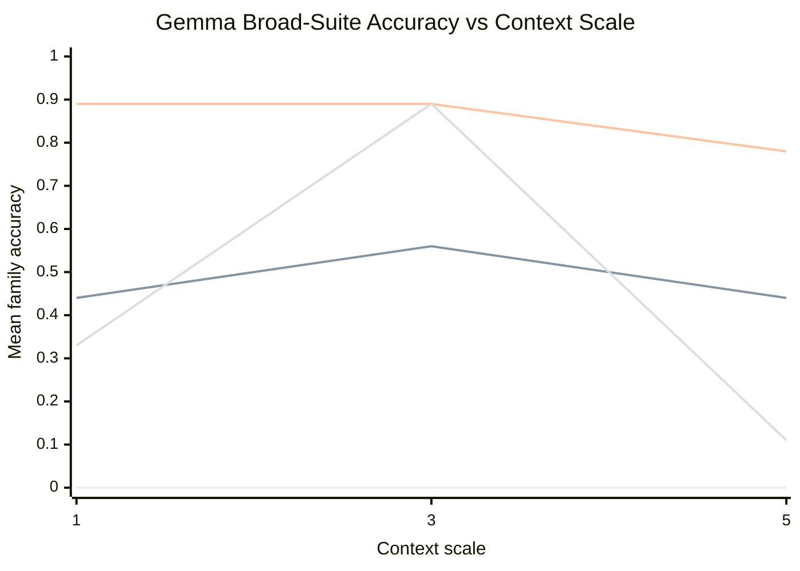

# Context Ladder Report

This report reruns the broader synthetic suite on the same Gemma model while increasing only the amount of filler context inside each family. The question is whether the same management advantage survives as the artifacts get longer.

## Setup

- model: `mlx-community/gemma-4-e2b-it-4bit`
- families: prose retrieval, ledger aggregation, code-like localization
- shared configuration: 4 sections, 6 distractors per section, seeds `0/1/2`
- context scales: `1`, `3`, and `5`

## Overall Accuracy By Context

| Context scale | Baseline | No-validator | Managed | Recursive |
| --- | --- | --- | --- | --- |
| `1` | 0.00 | 0.44 | 0.89 | 0.33 |
| `3` | 0.00 | 0.56 | 0.89 | 0.89 |
| `5` | 0.00 | 0.44 | 0.78 | 0.11 |

## Per-family Accuracy

| Family | `1x` no-validator | `1x` managed | `1x` recursive | `3x` no-validator | `3x` managed | `3x` recursive | `5x` no-validator | `5x` managed | `5x` recursive |
| --- | --- | --- | --- | --- | --- | --- | --- | --- | --- |
| Prose records | 0.33 | 0.67 | 0.33 | 1.00 | 1.00 | 1.00 | 0.67 | 0.33 | 0.33 |
| Ledger aggregation | 0.33 | 1.00 | 0.67 | 0.00 | 0.67 | 0.67 | 0.33 | 1.00 | 0.00 |
| Code localization | 0.67 | 1.00 | 0.00 | 0.67 | 1.00 | 1.00 | 0.33 | 1.00 | 0.00 |

## Reading The Pattern

- Baseline stayed at `0.00` across all three context settings, so one-shot prompting never recovered on this suite.
- Flat managed stayed strong overall and was the most stable method across families.
- Recursive routing was not monotonic. It peaked at the middle context scale and then collapsed on the longest setting.
- The no-validator condition stayed meaningfully below managed, which is more evidence that deterministic bookkeeping still matters.

## Conclusion

The Gemma context ladder does not support a simple claim that “more hierarchy always fixes more context.” On this broader suite, flat validator-backed decomposition is the most robust policy. Recursive routing helps on some benchmark shapes, but it is brittle enough that it should be treated as one policy family, not as a universal answer to long context.
