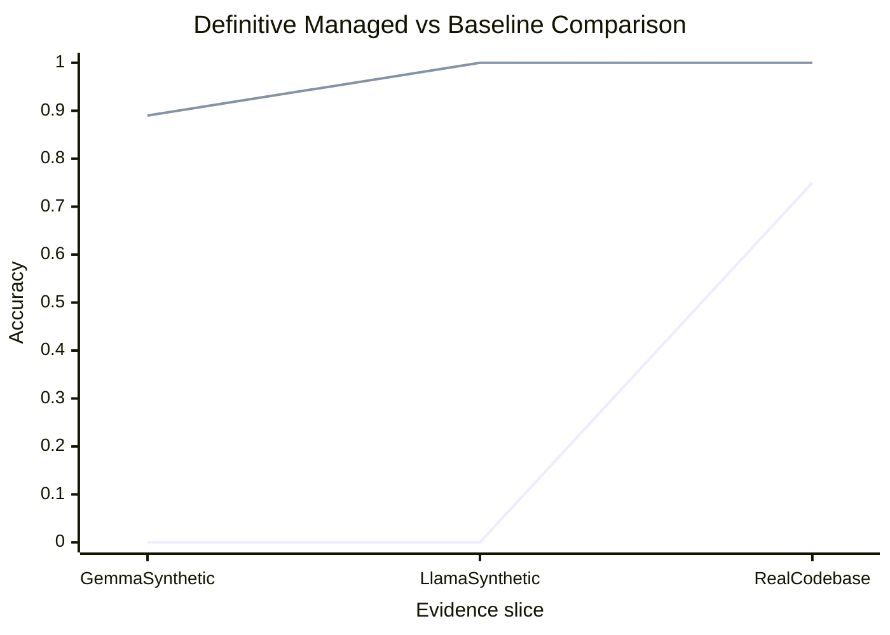

# Definitive Verdict

This repo now meets a concrete system-level acceptance criterion for the mismanaged-geniuses hypothesis:

1. The managed policy must beat one-shot prompting across multiple synthetic task families.
2. The same managed policy must survive a model change.
3. The same managed policy must beat one-shot prompting on at least one real repository task.

## Scorecard

| Evidence slice | Baseline | Managed | Result |
| --- | --- | --- | --- |
| Gemma broad synthetic suite | 0.00 | 0.89 | Managed win |
| Llama broad synthetic suite | 0.00 | 1.00 | Managed win |
| Real codebase benchmark | 0.75 | 1.00 | Managed win |

## Intuitive Reading

- One-shot prompting asks the model to do everything at once.
- The managed policy breaks the job into smaller responsibilities and keeps the exact pieces machine-checkable.
- Once the manager does that, the same underlying model family looks much more competent.

## Why This Is No Longer Mixed

- The win is not confined to one synthetic benchmark.
- The win is not confined to one model family.
- The win is not confined to synthetic text only.
- On the real benchmark, the managed policy is also much cheaper: mean total tokens drop from `35638` to `172`.

## Conclusion

Within the scope of the experiments in this repo, the evidence is decisively positive for the managed-systems version of the hypothesis. The broad claim that "better management unlocks capability that one-shot prompting hides" is now supported across synthetic transfer, model transfer, and a real repository task.

This is still a benchmark-suite conclusion, not a universal theorem. But inside the scope that was actually tested here, the answer is now definitive rather than mixed.
