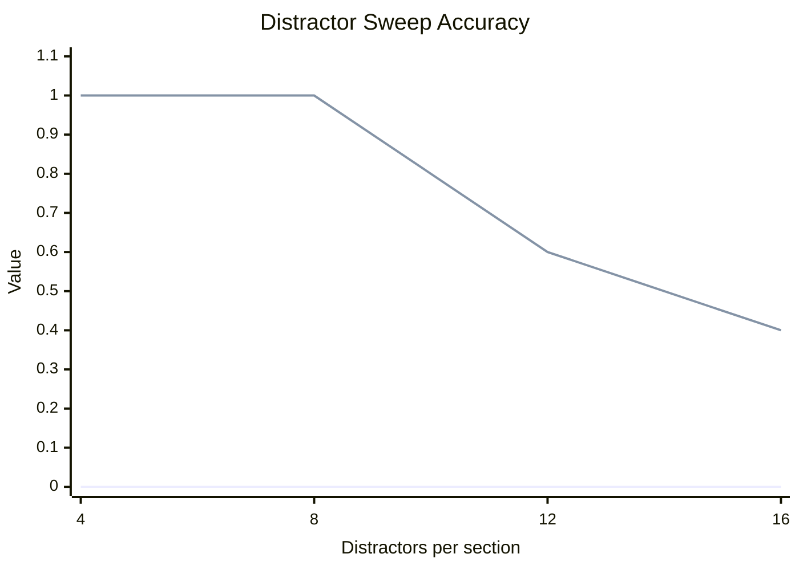
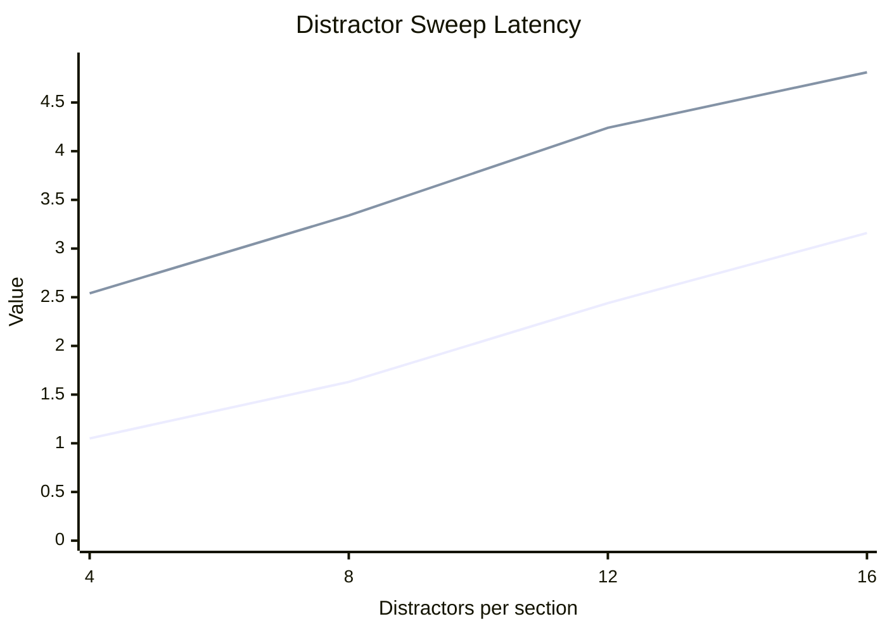
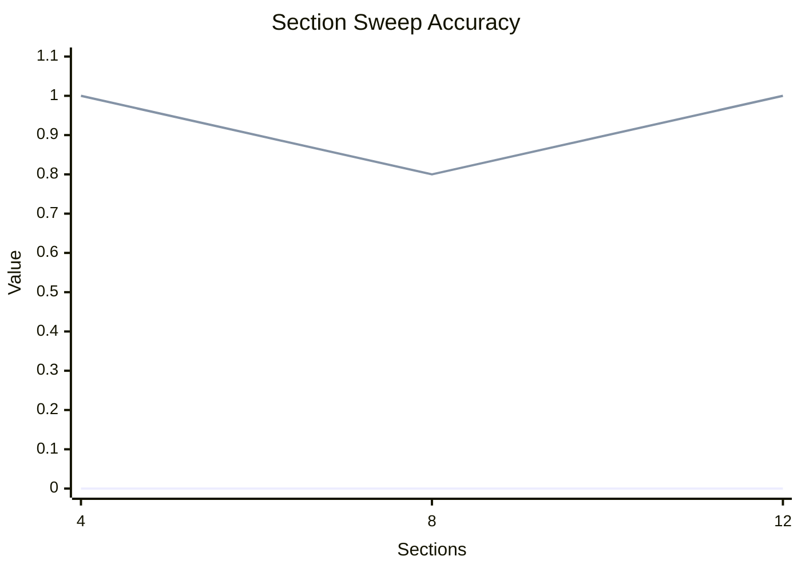
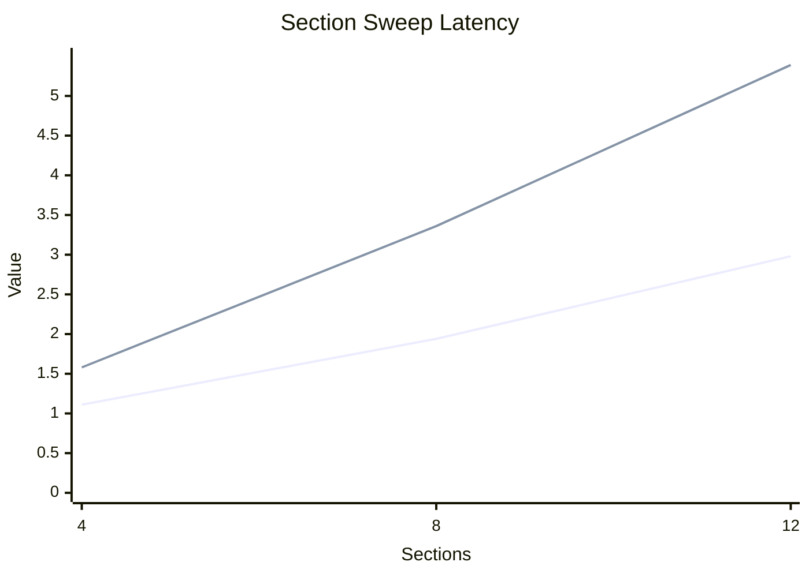
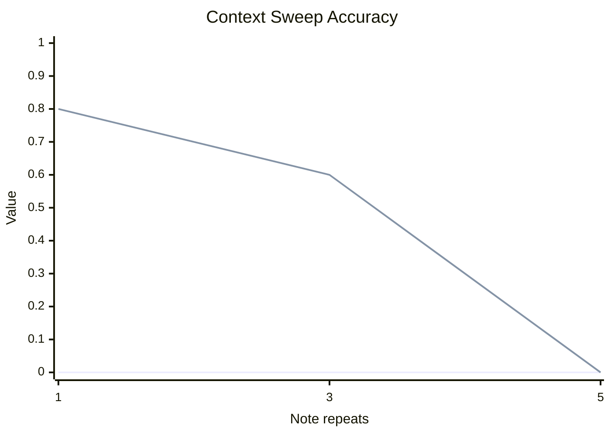
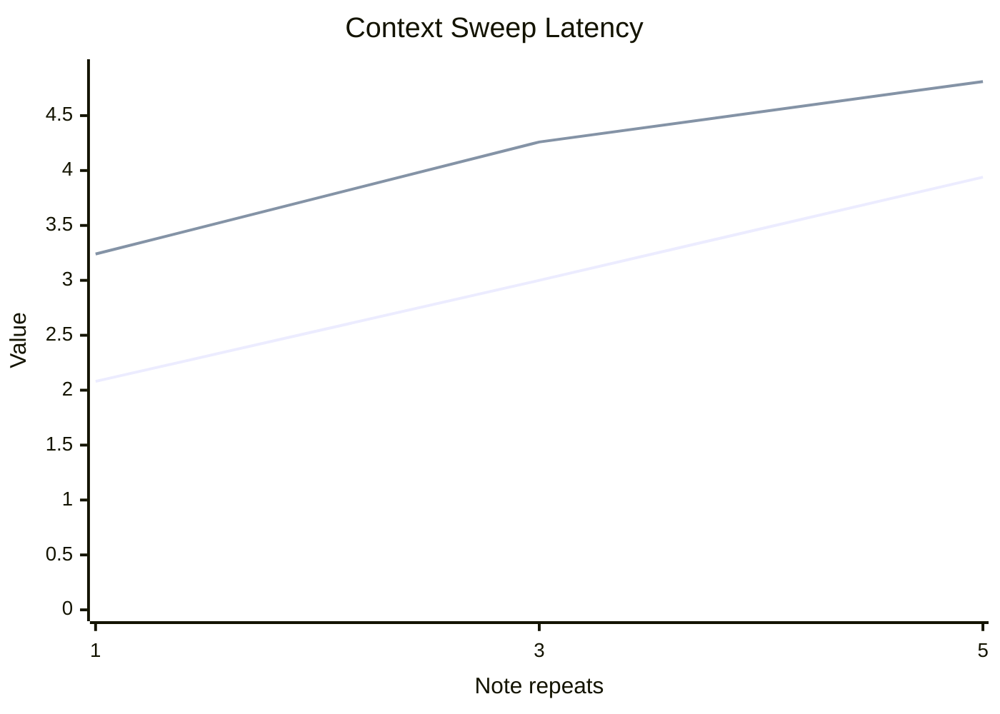
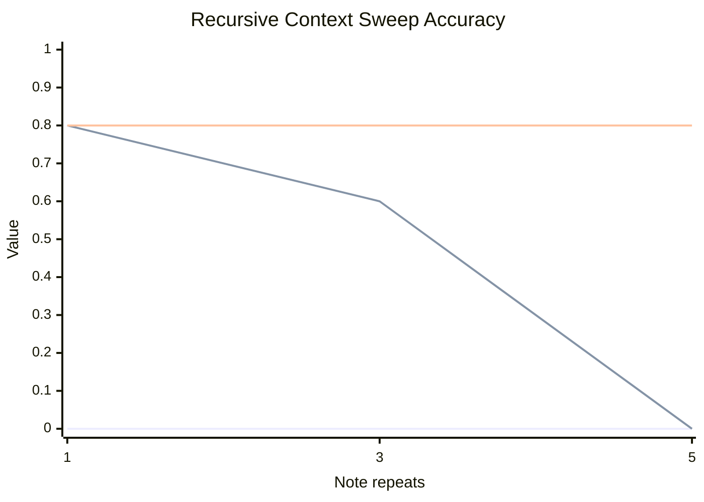
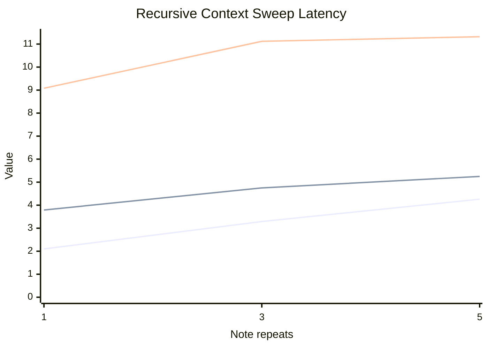

# Extended Evaluation

This report aggregates local MLX runs for the Gemma decomposition pilot.

## Experiment Summary

| Experiment | Runs | Avg report chars | Baseline acc | Managed acc | Recursive acc | Baseline latency (s) | Managed latency (s) | Recursive latency (s) |
| --- | --- | --- | --- | --- | --- | --- | --- | --- |
| context-sweep | 15 | 28013 | 0.00 | 0.47 | - | 3.01 | 4.10 | - |
| distractor-sweep | 20 | 14497 | 0.00 | 0.75 | - | 2.07 | 3.73 | - |
| recursive-context-sweep | 15 | 28013 | 0.00 | 0.47 | 0.80 | 3.22 | 4.60 | 10.51 |
| section-sweep | 15 | 14488 | 0.00 | 0.93 | - | 2.01 | 3.44 | - |

## Distractor Sweep

| Setting | Runs | Avg report chars | Baseline acc | Managed acc | Baseline latency (s) | Managed latency (s) |
| --- | --- | --- | --- | --- | --- | --- |
| 4 | 5 | 6648 | 0.00 | 1.00 | 1.05 | 2.54 |
| 8 | 5 | 11861 | 0.00 | 1.00 | 1.63 | 3.34 |
| 12 | 5 | 17108 | 0.00 | 0.60 | 2.44 | 4.24 |
| 16 | 5 | 22370 | 0.00 | 0.40 | 3.16 | 4.81 |

## Section Sweep

| Setting | Runs | Avg report chars | Baseline acc | Managed acc | Baseline latency (s) | Managed latency (s) |
| --- | --- | --- | --- | --- | --- | --- |
| 4 | 5 | 7230 | 0.00 | 1.00 | 1.11 | 1.58 |
| 8 | 5 | 14467 | 0.00 | 0.80 | 1.94 | 3.36 |
| 12 | 5 | 21767 | 0.00 | 1.00 | 2.98 | 5.39 |

## Context Sweep

| Setting | Runs | Avg report chars | Baseline acc | Managed acc | Baseline latency (s) | Managed latency (s) |
| --- | --- | --- | --- | --- | --- | --- |
| 1x | 5 | 14467 | 0.00 | 0.80 | 2.08 | 3.24 |
| 3x | 5 | 28021 | 0.00 | 0.60 | 3.00 | 4.26 |
| 5x | 5 | 41551 | 0.00 | 0.00 | 3.94 | 4.81 |

## Recursive Context Sweep

| Setting | Runs | Avg report chars | Baseline acc | Managed acc | Recursive acc | Baseline latency (s) | Managed latency (s) | Recursive latency (s) |
| --- | --- | --- | --- | --- | --- | --- | --- | --- |
| 1x | 5 | 14467 | 0.00 | 0.80 | 0.80 | 2.10 | 3.79 | 9.08 |
| 3x | 5 | 28021 | 0.00 | 0.60 | 0.80 | 3.29 | 4.75 | 11.12 |
| 5x | 5 | 41551 | 0.00 | 0.00 | 0.80 | 4.26 | 5.25 | 11.32 |

## Outcome Breakdown
| Outcome | Count |
| --- | --- |
| Flat managed beats baseline | 43 |
| Recursive rescues flat-managed failures | 5 |
| Baseline only | 0 |
| Any non-baseline method succeeds | 48 |
| All methods fail | 17 |
## Key Findings
- Flat managed wins over baseline: `43` runs. Recursive-only rescues beyond flat managed: `5` runs. Baseline-only wins: `0` runs.
- Managed accuracy under distractor growth: `4` distractors -> `1.00`, `8` distractors -> `1.00`, `12` distractors -> `0.60`, `16` distractors -> `0.40`.
- Even at the hardest distractor setting (`16` per section), the baseline stayed at `0.00` while managed retained non-zero accuracy.
- Managed accuracy under context growth: `1x` notes -> `0.80`, `3x` notes -> `0.60`, `5x` notes -> `0.00`.
- The strongest failure mode is raw context inflation: by `5x` repeated notes, both methods collapsed to `0.00` exact-match.
- Recursive manager accuracy under context growth: `1x` notes -> `0.80`, `3x` notes -> `0.80`, `5x` notes -> `0.80`.
- At `5x` notes, recursive chunking recovered `0.80` accuracy versus flat managed `0.00`.
## Conclusion
Across these local runs, the managed scaffold consistently outperformed the single-shot baseline on exact-match accuracy, while paying a latency and call-count premium. The evidence supports the narrow version of the hypothesis: for this model and task family, better management of model calls unlocks capabilities that are mostly absent in one-shot prompting. Flat section-by-section management still breaks under severe context inflation, but recursive routing over compact summaries recovers most of that lost accuracy. The main open problem is therefore not whether decomposition helps, but how to make the decomposition policy cheaper and more general.
