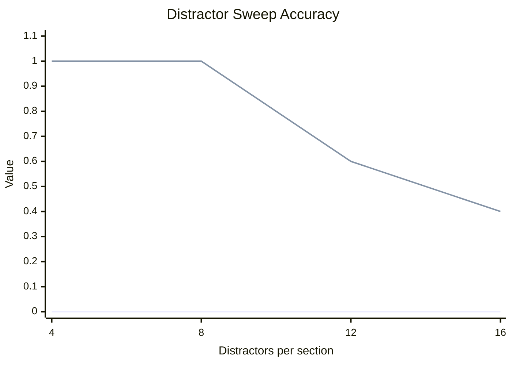
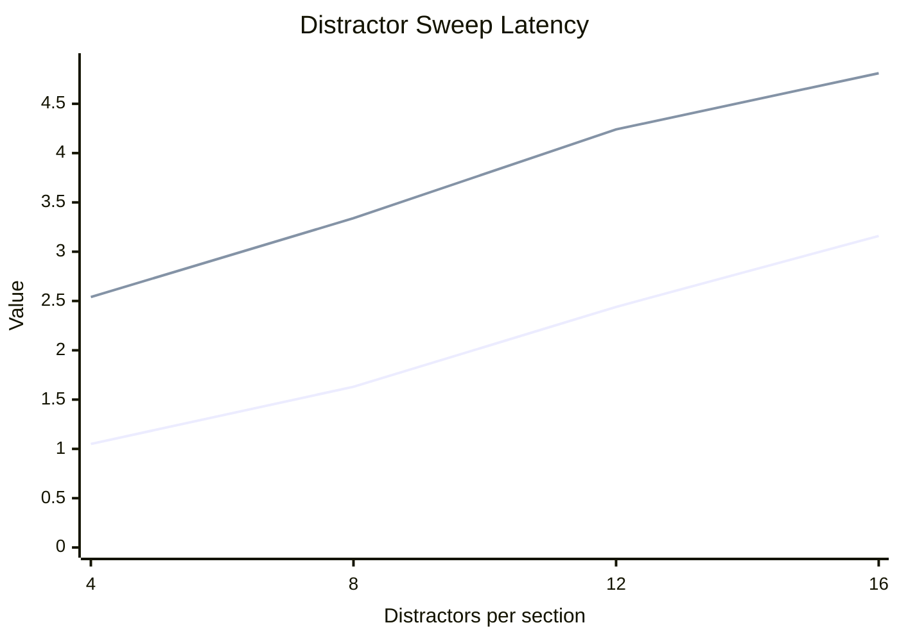
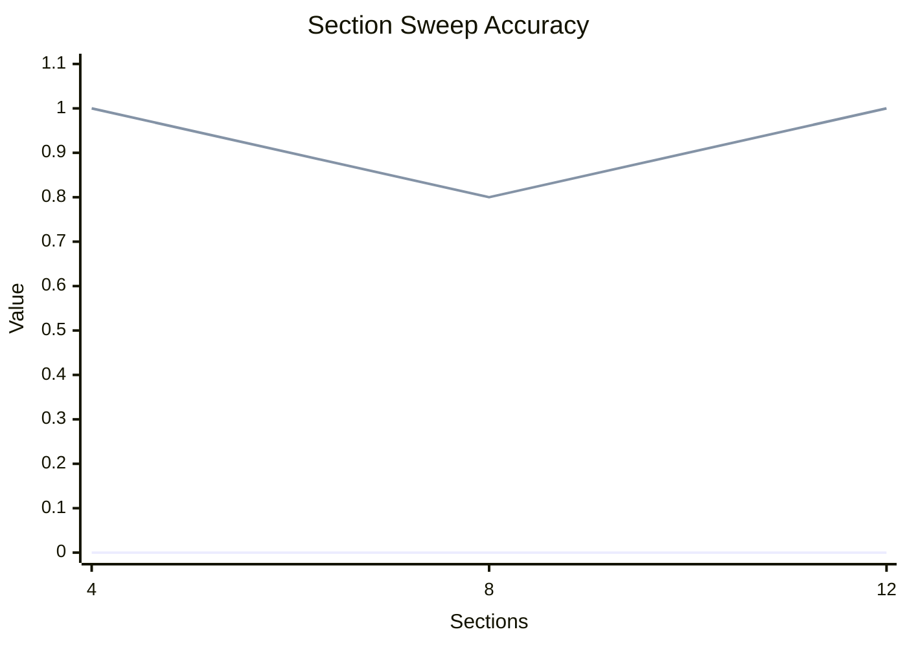
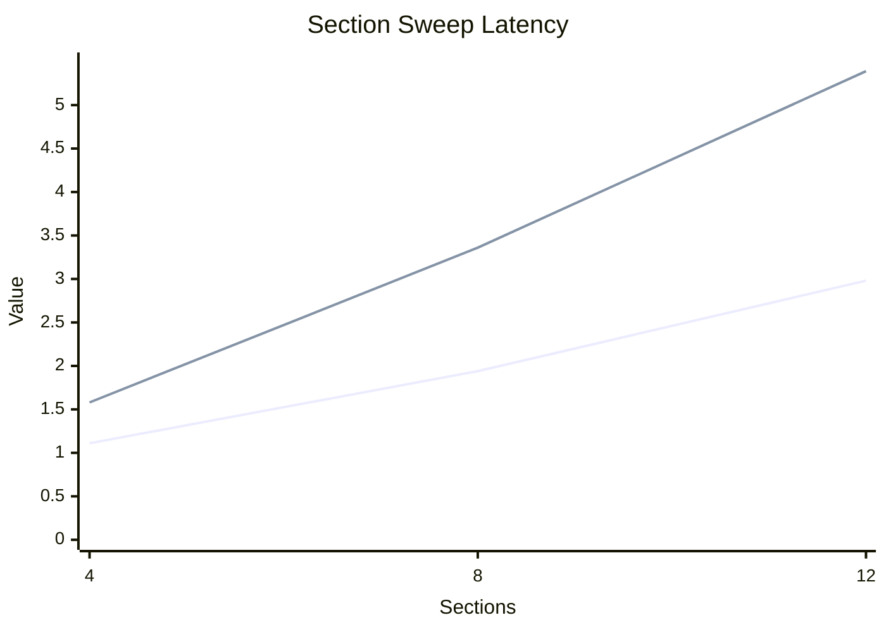
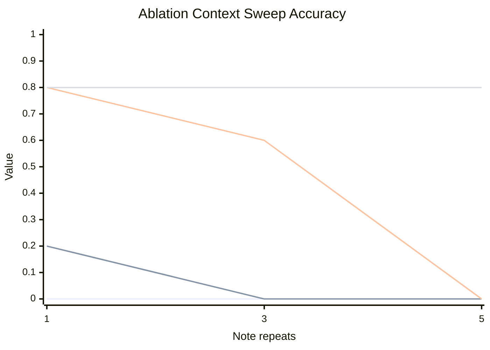
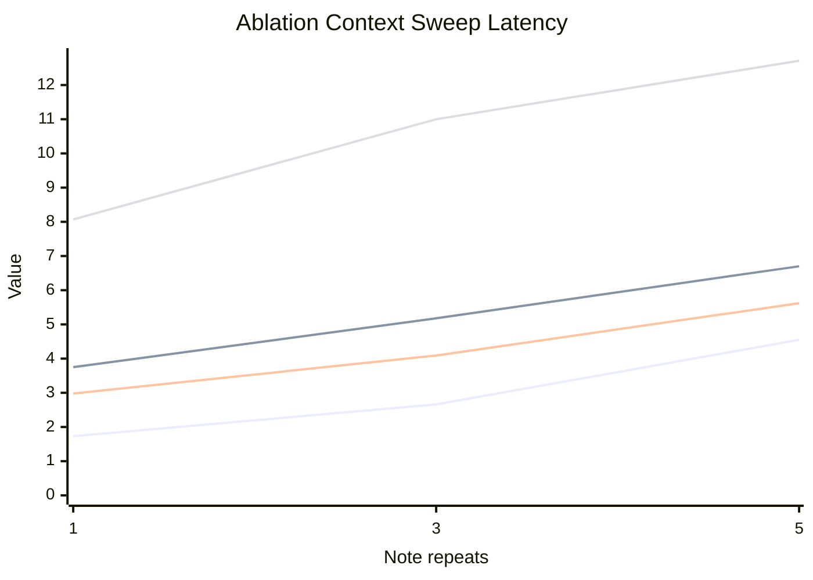

# Extended Evaluation

This report aggregates local MLX runs for the Gemma decomposition pilot.

## Experiment Summary

| Experiment | Runs | Avg report chars | Baseline acc | No-validator acc | Managed acc | Recursive acc | Baseline latency (s) | No-validator latency (s) | Managed latency (s) | Recursive latency (s) |
| --- | --- | --- | --- | --- | --- | --- | --- | --- | --- | --- |
| ablation-context-sweep | 15 | 28013 | 0.00 | 0.07 | 0.47 | 0.80 | 2.98 | 5.21 | 4.23 | 10.59 |
| distractor-sweep | 20 | 14497 | 0.00 | - | 0.75 | - | 2.07 | - | 3.73 | - |
| section-sweep | 15 | 14488 | 0.00 | - | 0.93 | - | 2.01 | - | 3.44 | - |

## Distractor Sweep

| Setting | Runs | Avg report chars | Baseline acc | Managed acc | Baseline latency (s) | Managed latency (s) |
| --- | --- | --- | --- | --- | --- | --- |
| 4 | 5 | 6648 | 0.00 | 1.00 | 1.05 | 2.54 |
| 8 | 5 | 11861 | 0.00 | 1.00 | 1.63 | 3.34 |
| 12 | 5 | 17108 | 0.00 | 0.60 | 2.44 | 4.24 |
| 16 | 5 | 22370 | 0.00 | 0.40 | 3.16 | 4.81 |

## Section Sweep

| Setting | Runs | Avg report chars | Baseline acc | Managed acc | Baseline latency (s) | Managed latency (s) |
| --- | --- | --- | --- | --- | --- | --- |
| 4 | 5 | 7230 | 0.00 | 1.00 | 1.11 | 1.58 |
| 8 | 5 | 14467 | 0.00 | 0.80 | 1.94 | 3.36 |
| 12 | 5 | 21767 | 0.00 | 1.00 | 2.98 | 5.39 |

## Ablation Context Sweep

| Setting | Runs | Avg report chars | Baseline acc | No-validator acc | Managed acc | Recursive acc | Baseline latency (s) | No-validator latency (s) | Managed latency (s) | Recursive latency (s) |
| --- | --- | --- | --- | --- | --- | --- | --- | --- | --- | --- |
| 1x | 5 | 14467 | 0.00 | 0.20 | 0.80 | 0.80 | 1.73 | 3.75 | 2.98 | 8.07 |
| 3x | 5 | 28021 | 0.00 | 0.00 | 0.60 | 0.80 | 2.66 | 5.18 | 4.09 | 11.00 |
| 5x | 5 | 41551 | 0.00 | 0.00 | 0.00 | 0.80 | 4.55 | 6.70 | 5.62 | 12.71 |

## Outcome Breakdown
| Outcome | Count |
| --- | --- |
| Flat managed beats baseline | 36 |
| No-validator beats baseline | 1 |
| Recursive rescues flat-managed failures | 5 |
| Baseline only | 0 |
| Any non-baseline method succeeds | 41 |
| All methods fail | 9 |
## Key Findings
- Flat managed wins over baseline: `36` runs. No-validator wins over baseline: `1` runs. Recursive-only rescues beyond flat managed: `5` runs. Baseline-only wins: `0` runs.
- Managed accuracy under distractor growth: `4` distractors -> `1.00`, `8` distractors -> `1.00`, `12` distractors -> `0.60`, `16` distractors -> `0.40`.
- Even at the hardest distractor setting (`16` per section), the baseline stayed at `0.00` while managed retained non-zero accuracy.
- Context ablation by method: `1x` -> baseline `0.00`, no-validator `0.20`, flat managed `0.80`, recursive `0.80`, `3x` -> baseline `0.00`, no-validator `0.00`, flat managed `0.60`, recursive `0.80`, `5x` -> baseline `0.00`, no-validator `0.00`, flat managed `0.00`, recursive `0.80`.
- At `5x` notes, no-validator management reached `0.00`, flat managed reached `0.00`, and recursive routing reached `0.80`.
## Conclusion
Across these local runs, the managed scaffold consistently outperformed the single-shot baseline on exact-match accuracy, while paying a latency and call-count premium. The evidence supports the narrow version of the hypothesis: for this model and task family, better management of model calls unlocks capabilities that are mostly absent in one-shot prompting. The new no-validator ablation shows that decomposition alone helps, but deterministic bookkeeping contributes meaningful extra reliability. Flat section-by-section management still breaks under severe context inflation, while recursive routing over compact summaries recovers most of that lost accuracy. The main open problem is therefore not whether decomposition helps, but how to make the decomposition policy both cheaper and more general.
