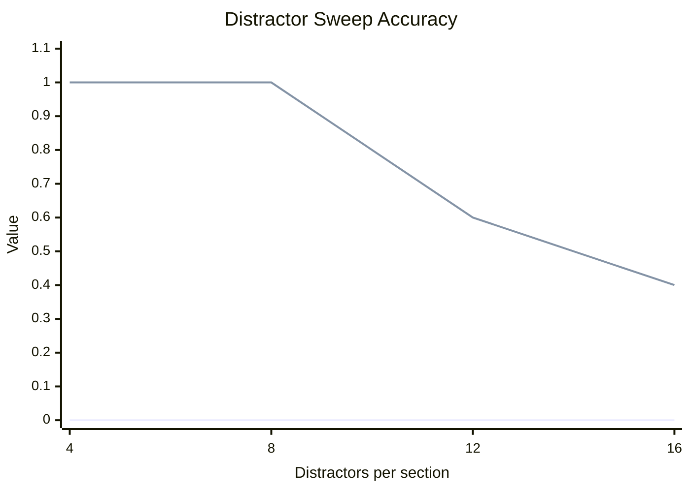
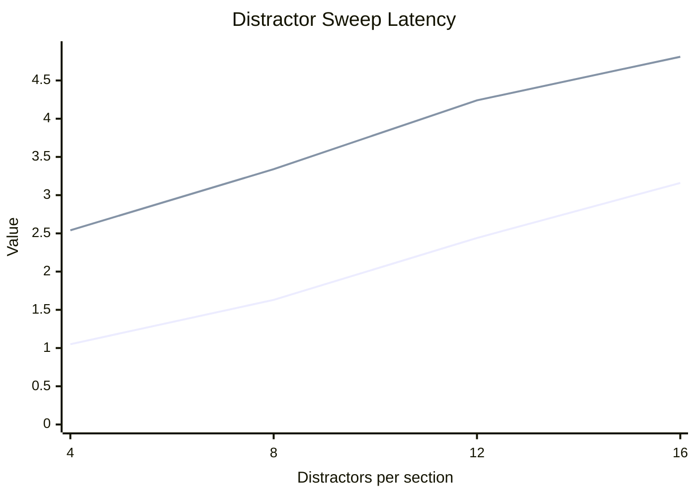
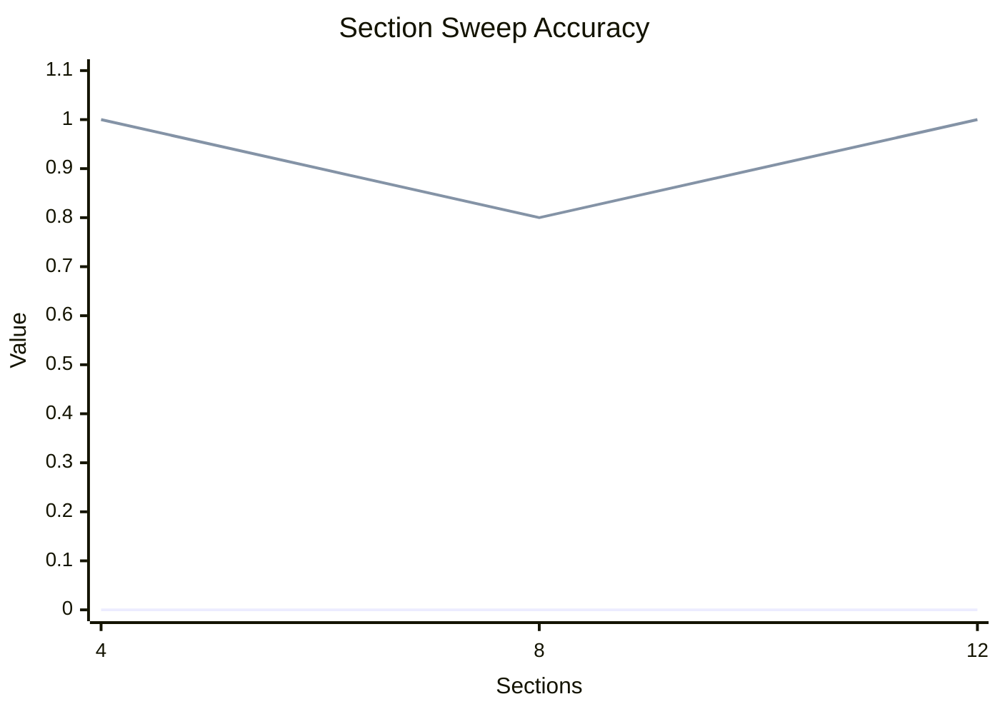
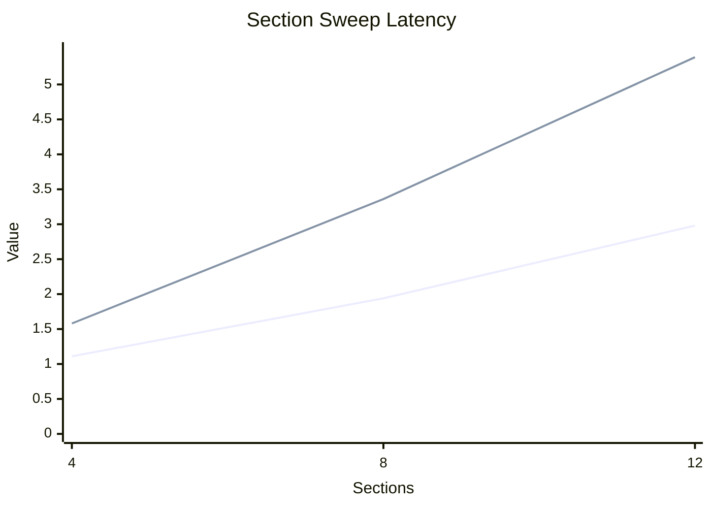
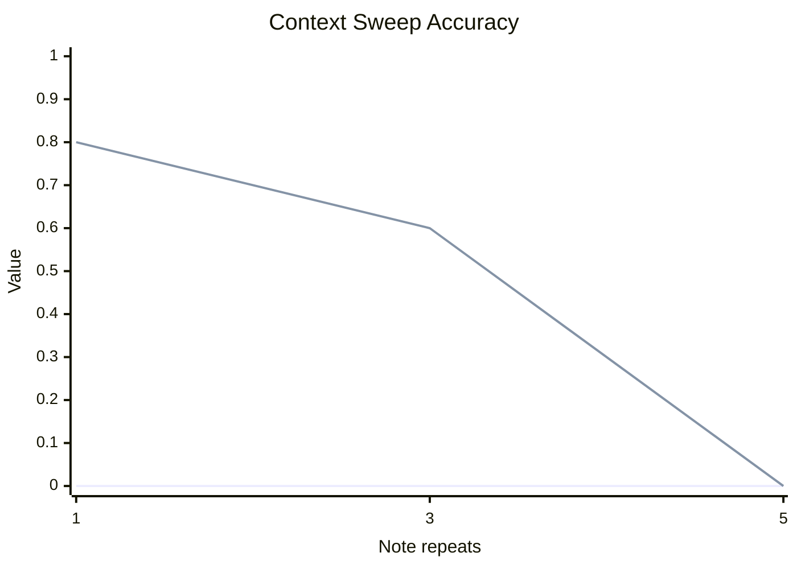
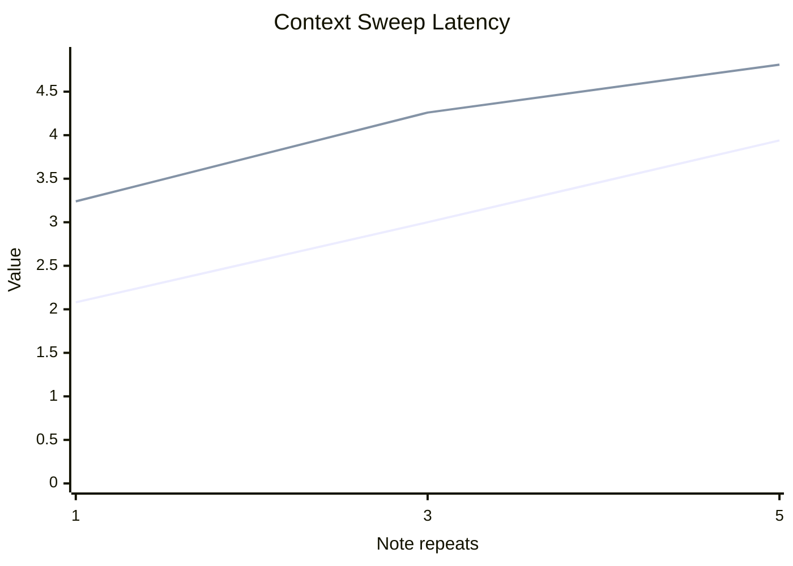

# Extended Evaluation

This report aggregates local MLX runs for the Gemma decomposition pilot.

## Experiment Summary

| Experiment | Runs | Avg report chars | Baseline acc | Managed acc | Baseline latency (s) | Managed latency (s) |
| --- | --- | --- | --- | --- | --- | --- |
| context-sweep | 15 | 28013 | 0.00 | 0.47 | 3.01 | 4.10 |
| distractor-sweep | 20 | 14497 | 0.00 | 0.75 | 2.07 | 3.73 |
| section-sweep | 15 | 14488 | 0.00 | 0.93 | 2.01 | 3.44 |

## Distractor Sweep

| Setting | Runs | Avg report chars | Baseline acc | Managed acc | Baseline latency (s) | Managed latency (s) |
| --- | --- | --- | --- | --- | --- | --- |
| 4 | 5 | 6648 | 0.00 | 1.00 | 1.05 | 2.54 |
| 8 | 5 | 11861 | 0.00 | 1.00 | 1.63 | 3.34 |
| 12 | 5 | 17108 | 0.00 | 0.60 | 2.44 | 4.24 |
| 16 | 5 | 22370 | 0.00 | 0.40 | 3.16 | 4.81 |

## Section Sweep

| Setting | Runs | Avg report chars | Baseline acc | Managed acc | Baseline latency (s) | Managed latency (s) |
| --- | --- | --- | --- | --- | --- | --- |
| 4 | 5 | 7230 | 0.00 | 1.00 | 1.11 | 1.58 |
| 8 | 5 | 14467 | 0.00 | 0.80 | 1.94 | 3.36 |
| 12 | 5 | 21767 | 0.00 | 1.00 | 2.98 | 5.39 |

## Context Sweep

| Setting | Runs | Avg report chars | Baseline acc | Managed acc | Baseline latency (s) | Managed latency (s) |
| --- | --- | --- | --- | --- | --- | --- |
| 1x | 5 | 14467 | 0.00 | 0.80 | 2.08 | 3.24 |
| 3x | 5 | 28021 | 0.00 | 0.60 | 3.00 | 4.26 |
| 5x | 5 | 41551 | 0.00 | 0.00 | 3.94 | 4.81 |

## Outcome Breakdown
| Outcome | Count |
| --- | --- |
| Managed only | 36 |
| Baseline only | 0 |
| Both pass | 0 |
| Both fail | 14 |
## Key Findings
- Managed-only wins: `36` runs. Baseline-only wins: `0` runs.
- Managed accuracy under distractor growth: `4` distractors -> `1.00`, `8` distractors -> `1.00`, `12` distractors -> `0.60`, `16` distractors -> `0.40`.
- Even at the hardest distractor setting (`16` per section), the baseline stayed at `0.00` while managed retained non-zero accuracy.
- Managed accuracy under context growth: `1x` notes -> `0.80`, `3x` notes -> `0.60`, `5x` notes -> `0.00`.
- The strongest failure mode is raw context inflation: by `5x` repeated notes, both methods collapsed to `0.00` exact-match.
## Conclusion
Across these local runs, the managed scaffold consistently outperformed the single-shot baseline on exact-match accuracy, while paying a latency and call-count premium. The evidence supports the narrow version of the hypothesis: for this model and task family, better management of model calls unlocks capabilities that are mostly absent in one-shot prompting. The main limit is not the decomposition idea itself but context scaling: once each chunk becomes too long, local retrieval recall collapses and the scaffold stops helping.
