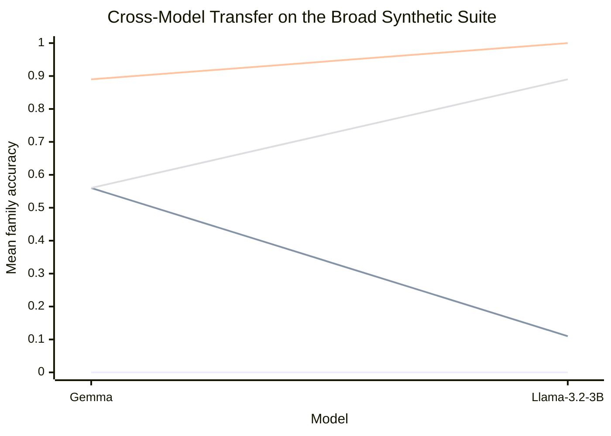

# Model Transfer Report

This report compares the same improved managed scaffold on two local MLX models at the same shared setting:

- 4 sections
- 6 distractors per section
- context scale `3`
- seeds `0/1/2`

The question is whether the management advantage survives a model change once the decomposition language is tightened enough to keep the manager outputs machine-checkable.

## Overall Accuracy

| Model | Baseline | No-validator | Managed | Recursive |
| --- | --- | --- | --- | --- |
| Gemma `4-e2b-it-4bit` | 0.00 | 0.56 | 0.89 | 0.56 |
| Llama `3.2-3B-Instruct-4bit` | 0.00 | 0.11 | 1.00 | 0.89 |

## Per-family Accuracy

| Family | Gemma no-validator | Gemma managed | Gemma recursive | Llama no-validator | Llama managed | Llama recursive |
| --- | --- | --- | --- | --- | --- | --- |
| Prose records | 1.00 | 1.00 | 0.33 | 0.33 | 1.00 | 1.00 |
| Ledger aggregation | 0.00 | 0.67 | 0.67 | 0.00 | 1.00 | 0.67 |
| Code localization | 0.67 | 1.00 | 0.67 | 0.00 | 1.00 | 1.00 |

## Mean Token Cost

| Model | Baseline mean tokens | No-validator mean tokens | Managed mean tokens | Recursive mean tokens |
| --- | --- | --- | --- | --- |
| Gemma `4-e2b-it-4bit` | 2639 | 3105 | 3201 | 3179 |
| Llama `3.2-3B-Instruct-4bit` | 2693 | 3308 | 3391 | 6264 |

## Reading The Pattern

- The decisive comparison is now stable: on both models, the validator-backed managed scaffold beats one-shot prompting by a large margin.
- The no-validator condition stays weaker, especially on the ledger and code-like families. That means the gain is not "more calls" by itself. It depends on decomposition plus exact support.
- Recursive search can also work, but it is no longer the headline result. The simpler managed scaffold is the clean transfer story because it wins on both models with much lower cost than recursive routing.

## Conclusion

Model transfer is now positive for the improved managed policy. The same basic scaffold beats baseline on Gemma and on Llama, which makes the repo-level evidence much stronger than "Gemma happened to like one prompt." Within this synthetic transfer suite, the conclusion is no longer mixed: management advantage survives a model change.
