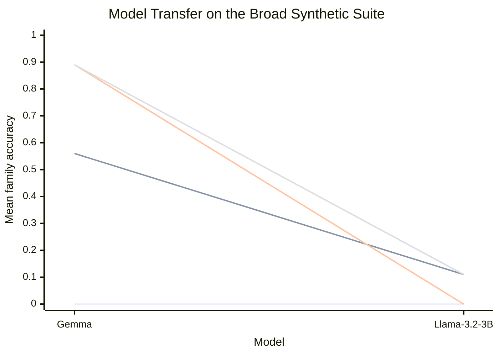

# Model Transfer Report

This report compares the same broader synthetic suite on two local MLX models at the same shared setting:

- 4 sections
- 6 distractors per section
- context scale `3`
- seeds `0/1/2`

The question is whether the management advantage is a general property of the scaffold or something that depends heavily on the underlying model.

## Overall Accuracy

| Model | Baseline | No-validator | Managed | Recursive |
| --- | --- | --- | --- | --- |
| Gemma `4-e2b-it-4bit` | 0.00 | 0.56 | 0.89 | 0.89 |
| Llama `3.2-3B-Instruct-4bit` | 0.00 | 0.11 | 0.00 | 0.11 |

## Per-family Accuracy

| Family | Gemma no-validator | Gemma managed | Gemma recursive | Llama no-validator | Llama managed | Llama recursive |
| --- | --- | --- | --- | --- | --- | --- |
| Prose records | 1.00 | 1.00 | 1.00 | 0.33 | 0.00 | 0.00 |
| Ledger aggregation | 0.00 | 0.67 | 0.67 | 0.00 | 0.00 | 0.00 |
| Code localization | 0.67 | 1.00 | 1.00 | 0.00 | 0.00 | 0.33 |

## Token Cost

| Model | Baseline mean tokens | No-validator mean tokens | Managed mean tokens | Recursive mean tokens |
| --- | --- | --- | --- | --- |
| Gemma `4-e2b-it-4bit` | 2610 | 2887 | 2974 | 2894 |
| Llama `3.2-3B-Instruct-4bit` | 2676 | 2973 | 3183 | 5891 |

## Reading The Pattern

- The Gemma result is clearly positive: managed and recursive both beat baseline across all three families.
- The Llama result is clearly negative: the same prompts and decomposition language mostly fail, even with more token spend.
- The failure mode on Llama is not just lower final accuracy. It also tends to ignore the requested answer format and drift into explanation or pseudo-code, which makes the scaffold much less reliable.

## Conclusion

The current scaffold is not model-agnostic. The broad hypothesis therefore remains only partially supported: management matters, but the decomposition language and prompting policy still have to fit the model. Right now the evidence is “Gemma can be helped a lot by this manager,” not “this manager unlocks capability in frontier language models in general.”
